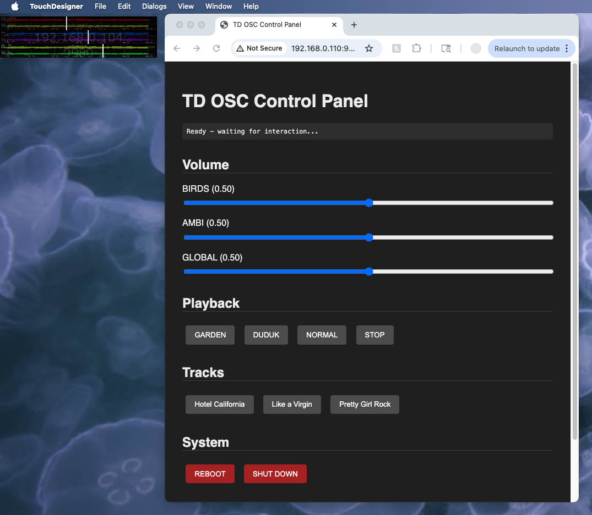

# BirdBoard - Ambient Audio Control System

A TouchDesigner-based ambient audio playback system with web-based remote control interface. 



This project began as a personal curiosity, since I like to hear ambient sound in the background of my home and workspaces. This app is designed as a relatively low-tech solution for dynamic ambient sounds wherever you need them. 

This can work for perosnal use, or installations that require blanket looped audio playback with day/night variations and special track triggers.

This application uses sound recordings from [myNoise.net](https://mynoise.net/noiseMachines.php). I encourage you to purchase some credits and download a few of your favorite tracks. You can always add some of your own audio recordings just the same.

---

## Overview

BirdBoard plays ambient audio tracks with automatic day/night variations, featuring:
- **2 audio layers**: Nature sounds and atmospheric ambience
- **Individual volume control** for each layer plus global volume
- **Special playback modes**: Special modes for when you want to switch from the default Day / Night tracks
- **Track triggers**: Play specific songs (this requires some deeper customization, but is a lot of fun!)
- **Web-based control panel** accessible from any device on the network
- **System controls**: Remote reboot and shutdown capabilities

---

## System Architecture

```
Web Browser (any device)
    ↓ HTTP GET requests
TouchDesigner WebServer DAT (port 9980)
    ↓ Python callbacks
```

### Key Components

1. **Web Interface** (`index.html`) - Browser-based control panel
2. **WebServer DAT** - TouchDesigner's built-in web server
3. **Callbacks** (`webserver_callbacks.py`) - Routes web requests to audio functions
4. **Audio Controller** (`ext_app_birdboard.py`) - Manages all audio playback
5. **Config** (`ext_birdboard_config.py`) - Network utilities for finding local IP
6. **Execute DAT** (`execute.py`) - Auto-launches web interface on TD startup

---

## Setup Instructions

### 1. TouchDesigner Setup

1. Open your BirdBoard TouchDesigner project
2. Link your media:
   - `/project1/bird_board_micro/audio` (Custom Pars page: Media)
      - Nature Day (audio file)
      - Nature Night (audio file)
      - Nature Special (audio file)
      - Atmosphere Day (audio file)
      - Atmosphere Night (audio file)
      - Atmosphere Special (audio file)
      - Hours Folder (audio folder)
3. Open your web server (see below)


## Usage

### Accessing the Control Panel

1. Start TouchDesigner project
2. Find your computer's local IP:
   - Run `op.config.GetAllIPAddresses()` in TD textport
   - OR check the `my_IPs` table in the config component
3. On any device on the same network, navigate to:
   ```
   http://[YOUR_IP]:9980
   ```
   Example: `http://192.168.1.100:9980`

## Control Panel Features

### Volume Controls
- **BIRDS**: Controls nature sound layer volume (0.0 - 1.0)
- **AMBI**: Controls atmospheric ambience volume (0.0 - 1.0)
- **GLOBAL**: Master volume control for both layers (0.0 - 1.0)

### Playback Modes
- **GARDEN**: Activates special nature mode
- **DUDUK**: Activates special ambient mode 
- **NORMAL**: Returns to normal ambient playback
- **STOP**: Stops all special tracks

### Track Selection
#### Note: these are special tracks that will require GUI customization in order to adjust
- **Hotel California**: Triggers playback of this specific song
- **Like a Virgin**: Triggers playback of this specific song
- **Pretty Girl Rock**: Triggers playback of this specific song

### System Controls
- **REBOOT**: Restarts the computer (Windows only)
- **SHUT DOWN**: Shuts down the computer (Windows only)

---

## Audio Playback Logic

### Ambient Audio
The system continuously plays two layers:
1. **Nature sounds**: Day/night variations via `filein_nature_day` and `filein_nature_night`
2. **Atmospheric ambience**: Day/night variations via `filein_ambi_day` and `filein_ambi_night`

### Special Modes
- **Normal**: `special` and `special_nature` constants set to 0
- **Duduk**: `special` constant set to 1
- **Garden**: `special_nature` constant set to 1

### Track Triggering
When a track button is pressed:
1. Audio File In CHOP `.par.play` is set to 1
2. `.par.cuepulse.pulse()` is triggered to start from cue point
3. Track plays over ambient audio

When STOP is pressed:
1. All track Audio File In CHOPs `.par.play` set to 0
2. All `.par.cuepulse.pulse()` triggered to reset to beginning

---

## Web Communication Protocol

### Request Format
All control commands use HTTP GET requests:
```
GET /set?topic=[COMMAND]&value=[VALUE]
```

### Available Commands

| Command | Value | Action |
|---------|-------|--------|
| `/vol_global` | 0.0-1.0 | Set global volume |
| `/vol_birds` | 0.0-1.0 | Set nature layer volume |
| `/vol_ambi` | 0.0-1.0 | Set ambience layer volume |
| `/special` | 1 | Activate duduk mode |
| `/special_nature` | 1 | Activate garden mode |
| `/normal` | 1 | Return to normal mode |
| `/stop` | 1 | Stop all special tracks |
| `/hotelcalifornia` | 1 | Play Hotel California |
| `/likeavirgin` | 1 | Play Like a Virgin |
| `/prettygirlrock` | 1 | Play Pretty Girl Rock |
| `/sync` | 1 | Enable sync mode |
| `/async` | 1 | Disable sync mode |
| `/reboot` | 1 | Reboot system |
| `/shutdown` | 1 | Shutdown system |

### Response Format
Success: `200 OK: [command]=[value]`
Error: `400 Missing topic or value`

---

## Debugging

### Enable Debug Output

The webserver callbacks include detailed logging. Look for these messages in the TouchDesigner textport:

```
==================================================
WEB | Method: GET
WEB | Path: /set
WEB | Parsed query: {'topic': ['/stop'], 'value': ['1']}
==================================================
WEB | /set endpoint hit!
WEB | Parsed topic: "/stop"
WEB | Parsed value: "1"
WEB | web_rx → /stop = 1
WEB | web_rx → Handling: /stop = 1
```

## Network Configuration

### Firewall Rules
Ensure port 9980 is allowed through the firewall:

**Windows:**
```powershell
netsh advfirewall firewall add rule name="TouchDesigner WebServer" dir=in action=allow protocol=TCP localport=9980
```

**macOS:**
```bash
# System Preferences → Security & Privacy → Firewall → Firewall Options
# Add TouchDesigner to allowed applications
```

### Multiple Devices
Any device on the same local network can access the control panel:
- Tablets
- Smartphones  
- Other computers
- Touch panel controllers

Simply navigate to `http://[TOUCHDESIGNER_IP]:9980` from any browser.

---

## Troubleshooting

### WebServer DAT won't start
- Check if another application is using port 9980
- Try changing to a different port (update both WebServer DAT and `execute.py`)

### Audio not playing
- Check your audio files in op.birdboard_audio
- Link your media: `/project1/bird_board_micro/audio` custom page: Media

### Reboot/Shutdown not working
- These commands only work on Windows
- Requires administrator privileges
- For macOS, update commands in `ext_app_birdboard.py`:
  ```python
  os.system("sudo shutdown -r now")  # Reboot
  os.system("sudo shutdown -h now")  # Shutdown
  ```

---

## Future Enhancements

- [ ] Implement true sync mode for multi-device installations
- [ ] Create preset system for different scenes/modes
- [ ] Save/load volume presets

---

## Version History

### v2.0 (Current)
- Switched from Node.js/OSC to WebServer DAT
- Simplified architecture
- Fixed JavaScript template literal bugs
- Added comprehensive debugging

### v1.0 (Legacy)
- Node.js + Express + node-osc
- OSC communication between Node and TD
- Multiple OSC receiver ports
